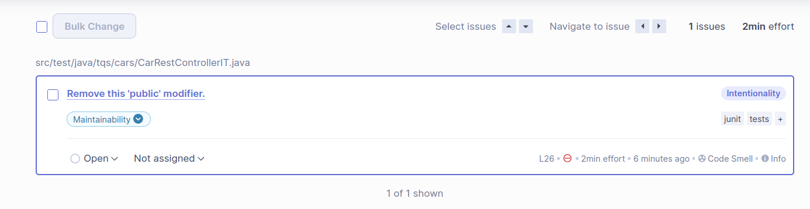
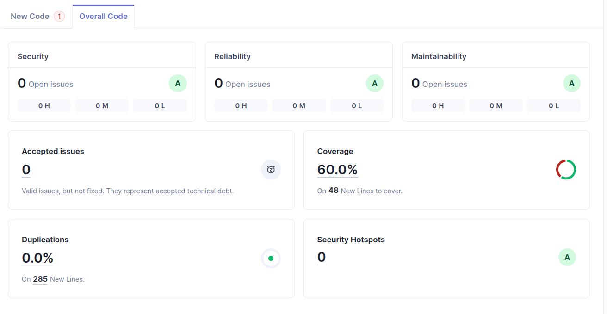
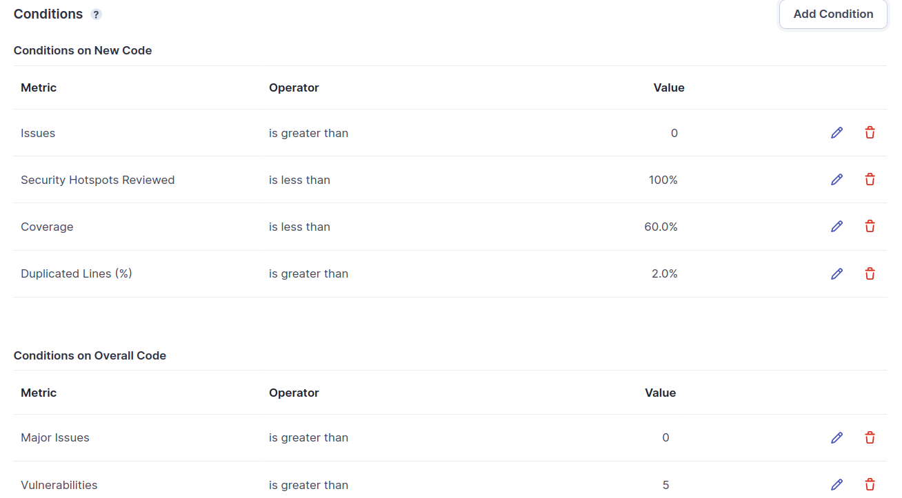

## 6.2

#### a) Analysis of the technical debt

The technical debt is the time needed to fix the project issues, in this case the project only needs 2 minutes to fix the single issue it has.

#### b) Correcting issues

Since there was only a minor issue dealing with the public visibility of a test, I changed the visibility to default and now there are no issues on the new analysis.

#### c) Code coverage report

The code coverage report indicates 60% of coverage, with 48 lines to cover. An appropriate analysis of these lines says that although most of them are equals or hashCode functions and these should not be tested, there is a function of saving a car in CarManagerService that is not being covered by the tests.

## 6.3

#### a) Custom quality gate

I established a custom gate that allows the 60% coverage to pass under the new gate, because I feel that there is no real use for the save function in car service because of the conditions of these tests using inject mocks.

#### b) Increments to source code

